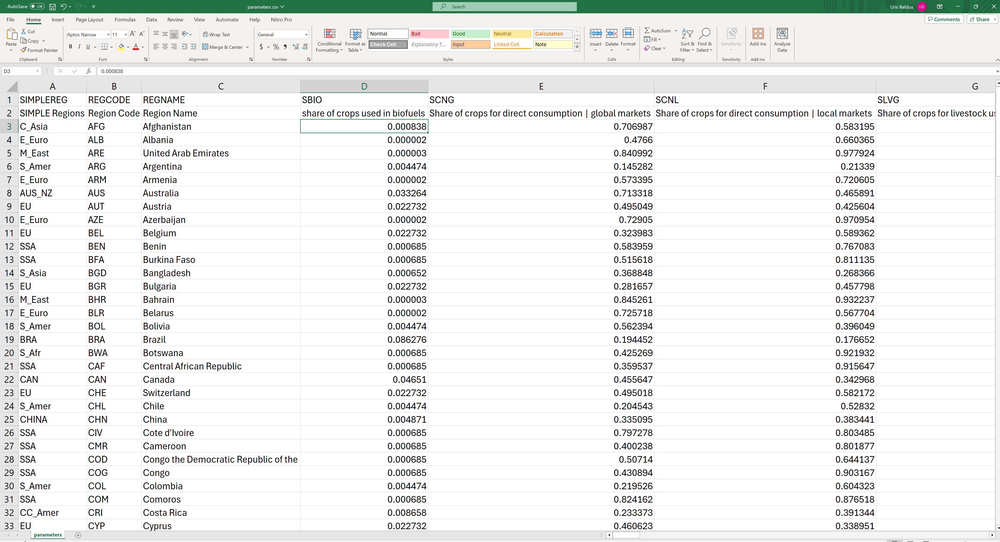
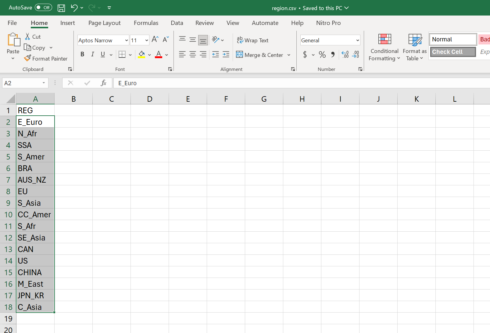
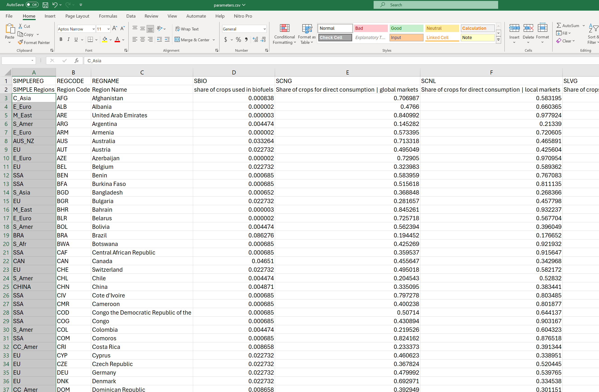

# SIMPLE Database Tool
### Version 1.0 (May 2024)
### By Uris Lantz Baldos, Venkata Divya Sree Pulipati, Jungha Woo, and Rajesh Kalyanam


#### Overview

This tool creates the database for the SIMPLE model (Simplified International Model of agricultural Prices, Land use and the Environment). The SIMPLE model has been used for the long run analysis of global agriculture. It considers key demand drivers such as population, per capita income, dietary upgrading as well as biofuel feedstock demand, and key supply drivers such as climate change and productivity growth. 

The database generated from this tool is compatible with the version 3.0 of the SIMPLE model which can be downloaded here (http://dx.doi.org/10.13019/RPZW-B). In summary, this tools does the following tasks:

1) Downloads crop production, produce price, cropland, population and real GDP data from FAOSTAT (https://www.fao.org/faostat/en/) based on user specified years
2) Computes aggregated crop production data for 135 crops using global price of corn as weights and calculates total value of crop production for each country
3) Calculates the rest of the database using economic shares, parameters and other key inputs from the parameter.csv file
4) Aggregates the database given regional aggregation in the region.csv file and regional mapping specified in the parameter.csv file

#### 1. Generating the standard database

To generate the standard database, users need to specify the years of the *start_year* and *end_year* in the code below. Note that errors will occur for years which are not available from FAOSTAT. Please check FAOSTAT for the latest year available.
```python
start_year = "2015"
end_year = "2020"
params_simple_data_proc = {"start_year": start_year, "end_year": end_year} 
params_simple_data_proc
```

#### 2. Changing economic shares, parameters and other key inputs

Users can change the key inputs in their own database by downloading the parameter.csv file, making the changes and then uploading the new parameter.csv file.

 The following are the sources of the default values for key inputs in the database:
- GTAP v11.a for year 2017 for key economic shares and input and output GHG emissions
- GTAPBIO v10 for year 2014 for biofuel crop feedstock share 
- Carbon trade off for land use change emissions from earthstat.org
- Food security data for year 2017 from FAOSTAT
sources of 
For model parameters see (https://doi.org/10.1017/aae.2023.29)e.2023.29)e.2023.29)f550966baf.png)


#### 3. Changing regional aggregation

There are two steps needed to change the regional aggregation. Users should first download the region.csv file, make changes to the regions, then upload the new region.csv file.



After uploading the new region.csv file, users should download and edit the regional mapping in the parameter.csv file which is under the "SIMPLE Regions" column A. Make sure all countries are mapped to each region. After making the changes, upload the new parameter.csv file.




Send questions or comments to: ubaldos@purdue.edu


```python
import cybergis_compute_client
from cybergis_compute_client import CyberGISCompute

cybergis = CyberGISCompute(url="cgjobsup.cigi.illinois.edu", isJupyter=True, protocol="HTTPS", port=443, suffix="v2")
cybergis.show_ui(defaultJob="SimpleDataProc_Processor", defaultDataFolder="./configs", input_params=params_simple_data_proc)
```

### Launch on I-GUIDE Platform

[Launch Notebook] (https://jupyter.iguide.illinois.edu/hub/user-redirect/git-pull?repo=https%3A%2F%2Fgithub.com%2FI-GUIDE%2Fsimpledataproc&urlpath=lab%2Ftree%2Fsimpledataproc%2FSIMPLE_G.ipynb+&branch=main)
